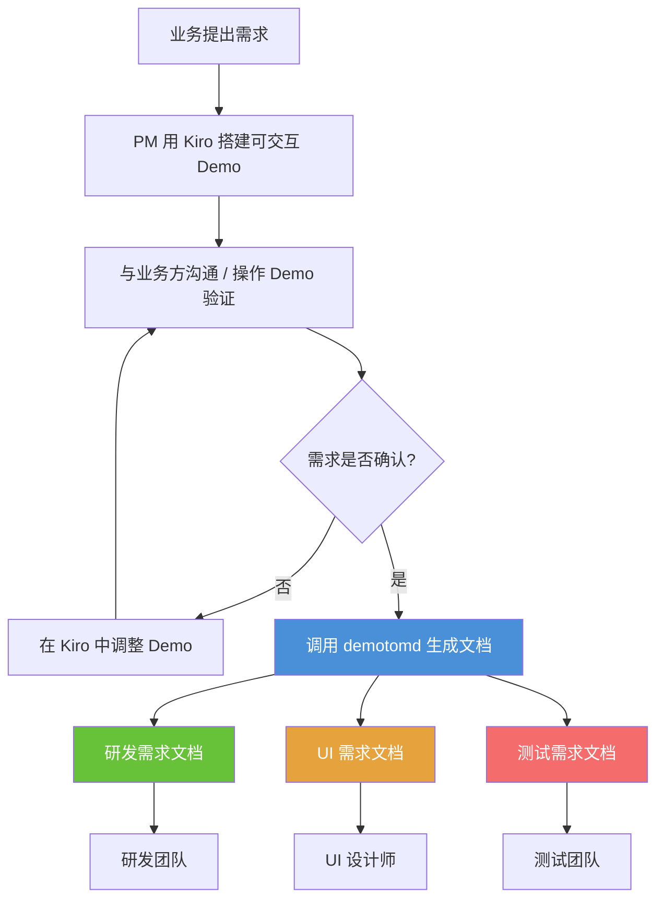
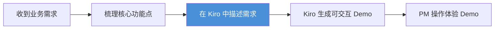
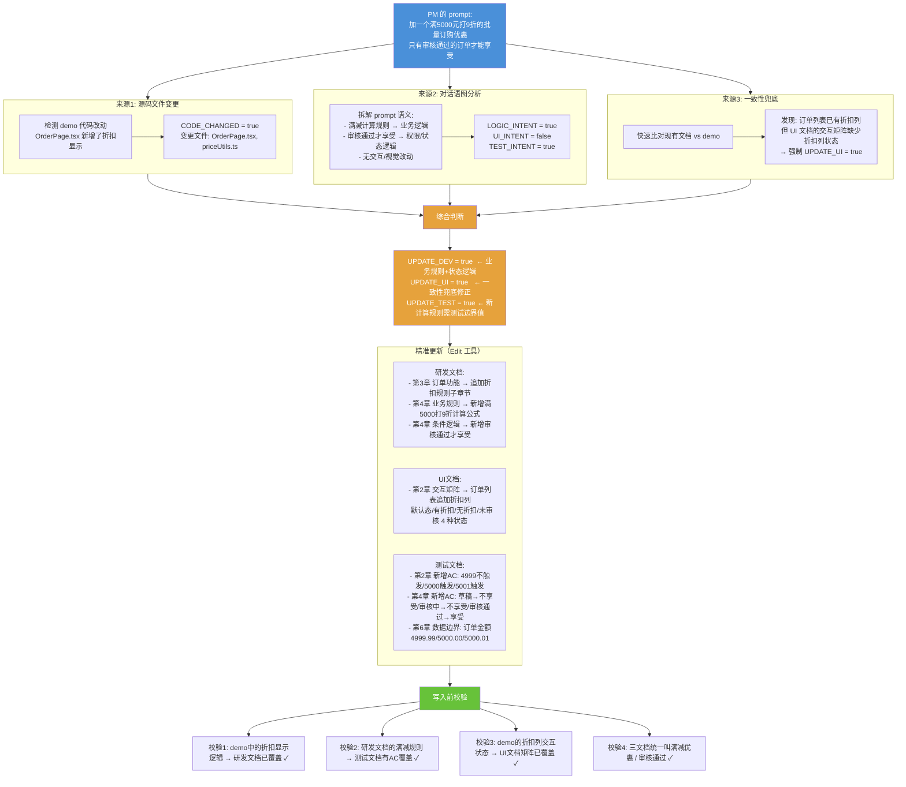
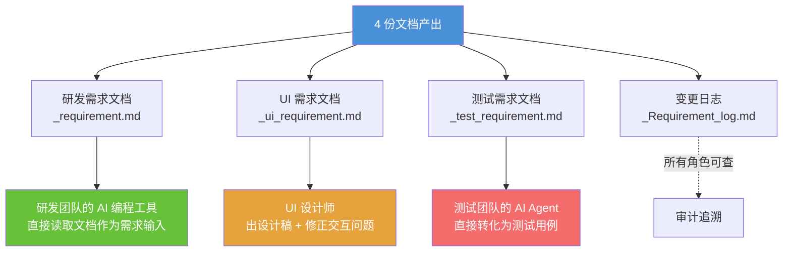
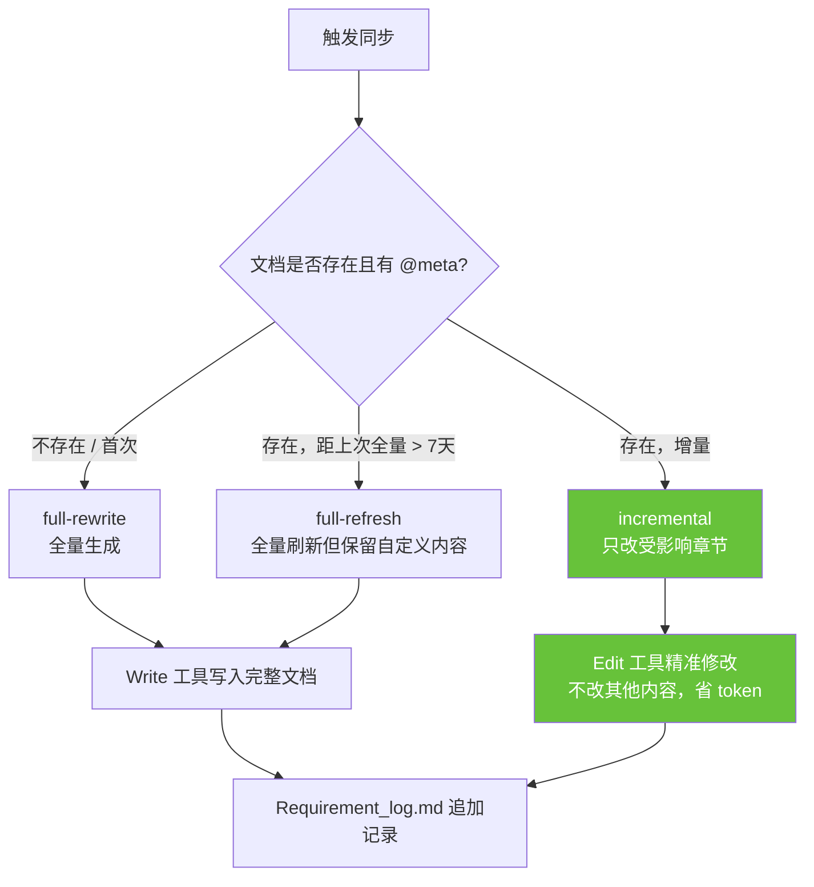

# 产品经理 DemoToMD 工作流

> 本文档描述产品经理使用 Kiro（或其他 AI 编程工具）设计原型、迭代需求、产出文档的完整工作流。

---

## 整体流程概览



---

## 阶段一：需求理解与 Demo 搭建



**PM 在 Kiro 中的典型操作**：

1. 新建 session，描述产品目标（例如："做一个出版社图书订购系统，支持学校下单、教材目录管理、订单审批、物流跟踪"）
2. Kiro 生成初始 demo，PM 在浏览器中预览
3. PM 体验后，用自然语言告诉 Kiro 需要调整的地方

---

## 阶段二：迭代 Demo（核心循环）

### 整体迭代流程

```mermaid
flowchart TB
    S([本轮对话开始]) --> P[PM 输入调整 prompt]
    P --> K[Kiro 修改 Demo]
    K --> R{是否满意?}
    R -- 否 --> P
    R -- 是 --> T{本轮是否结束?}
    T -- 否，继续调整 --> P
    T -- 是，同步文档 --> SYNC

    SYNC[/demotomd 或 同步需求] --> DETECT{Phase A: 检测变更}
    DETECT --> |源码改动| CODE[分析变更文件]
    DETECT --> |对话意图| PROMPT[分析 PM 的 prompt]
    DETECT --> |一致性校验| CONSIST[文档 vs 源码比对]

    CODE --> JUDGE
    PROMPT --> JUDGE[综合判断更新范围]
    CONSIST --> JUDGE
    JUDGE --> ANALYZE[Phase B: 分析 Demo 代码]
    ANALYZE --> GEN[Phase C: 增量生成/更新文档]
    GEN --> VALIDATE[Phase D: 一致性校验 + PM 确认]
    VALIDATE --> E([本轮对话结束])

    style SYNC fill:#4A90D9,color:#fff
    style JUDGE fill:#E6A23C,color:#fff
    style VALIDATE fill:#67C23A,color:#fff
```

### 核心详解：一句 prompt 如何变成文档更新

以 PM 说 **"加一个满 5000 元打 9 折的批量订购优惠，只有审核通过的订单才能享受"** 为例，展示 demotomd 的完整判断链路：



### PM 的 prompt 类型与文档更新的关系

| PM 说了什么 | Demo 是否改动 | 研发文档 | UI 文档 | 测试文档 |
|------------|-------------|---------|---------|---------|
| "加一个满减促销规则" | 可能改了显示，计算逻辑在后端 | **更新** | - | **更新** |
| "这个按钮换个位置，加个 icon" | 改了 | - | **更新** | - |
| "新增一个审批流程页面" | 改了 | **更新** | **更新** | **更新** |
| "订单超时要弹提示" | 可能没改 | **更新** | - | **更新** |
| "管理员可以查看所有订单" | 可能没改 | **更新** | **更新** | **更新** |
| "这段描述文字改一下措辞" | 没改 | 仅更新文字 | - | - |

---

## 阶段三：文档交付



**各角色拿到文档后的工作**：

| 角色 | 拿到什么 | 怎么用 |
|------|---------|--------|
| 研发 | `_requirement.md` + 可操作 Demo | 把文档喂给自己的 AI 编程工具（Kiro/Claude Code），按文档开发。遇到不清楚的操作 Demo 体验 |
| UI 设计师 | `_ui_requirement.md` + 可操作 Demo | 按 7 态矩阵出设计稿、补 Icon、修正交互问题、确认响应式方案 |
| 测试 | `_test_requirement.md` | 测试 AI Agent 读取文档，直接生成测试用例。PM 不需要再单独写测试需求 |
| 所有人 | `_Requirement_log.md` | 查看历次变更记录，知道每次改了什么 |

---

## 文档增量更新机制



---

## 文档结构与撰写着重点

### 三份文档的章节组成与着重点对比

| 章节 | 研发需求文档 `_requirement.md` | UI 需求文档 `_ui_requirement.md` | 测试需求文档 `_test_requirement.md` |
|------|-------------|-----------|-------------|
| **1** | **产品概述** — 产品描述 + 目标用户，让研发理解业务背景 | **页面结构与导航** — 页面清单 + 参数传递对 UI 的影响 | **测试范围与优先级** — 功能清单 + P0/P1/P2 + 变更 vs 未变更 |
| **2** | **页面结构与导航** — 页面清单 + 导航关系 + **页面间参数传递** | **交互状态清单** — 每个元素的**7态矩阵**（默认/hover/激活/loading/禁用/错误/空态） + 弹窗浮层 + 反馈提示 | **业务逻辑验收标准** — 每个功能的详细 AC（前置条件 + 测试步骤 + 测试数据 + 预期结果） |
| **3** | **功能逻辑** — 操作流程（流程图）+ 状态机（图+表）+ 交互规则 + 校验规则 + 4类极限场景 + 验收标准 | **视觉元素需求清单** — Icon 需求（哪些用文字/emoji代替了）+ 插图/空状态图 + 占位图/默认图 | **角色与权限测试矩阵** — 每个角色 × 每个功能点的权限（可见/可操作/隐藏/禁用） |
| **4** | **业务规则** — 计算规则（公式）+ 条件逻辑（展示/隐藏/启用/禁用）+ 数据处理规则 | **交互问题标注** — 交互逻辑问题 + 缺失的交互反馈 + 响应式适配需求 | **状态流转测试** — 合法转换 + 非法转换，每条含预期 UI 变化 |
| **5** | **数据模型** — 核心实体字段 + **Mock 数据说明**（哪些是假的，正式要对接什么） | **组件复用说明** — 重复 UI 模式 + 现有设计系统复用情况 | **极限场景测试清单** — 4类：内容溢出 / 空内容 / 网络异常 / 操作异常 |
| **6** | **已知缺口** — 简化逻辑 + 缺失功能 + TODO/FIXME，明确告知哪些需要重写 | — | **数据边界测试** — 每个字段的正常值 / 边界值 / 异常值 |
| **7** | **数据埋点** — 核心指标 + 页面浏览 + 用户行为 + 业务事件 | — | **回归测试建议** — 冒烟测试清单 + 关联功能回归 |

### 各文档的撰写着重点

**研发需求文档** — 聚焦 **"做什么"**
> 核心读者是研发的 AI 编程工具。写清楚每个功能的业务规则、计算公式、状态流转、数据结构、埋点事件。不涉及技术实现细节和 UI 视觉规格。着重点是让 AI 能无歧义地理解产品意图。

**UI 需求文档** — 聚焦 **"长什么样"**
> 核心读者是 UI 设计师。每个交互元素必须覆盖 7 种状态（默认/hover/激活/loading/禁用/错误/空态），列出所有需要设计的 Icon、插图、空状态图，标注 demo 中的交互问题。着重点是补齐 demo 中粗糙或缺失的视觉元素。

**测试需求文档** — 聚焦 **"怎么验证"**
> 核心读者是测试团队的 AI Agent。每个 AC 都包含具体的测试步骤、测试数据和预期结果，可直接转化为测试用例。覆盖角色权限矩阵、状态合法/非法转换、4 类极限场景、每个字段的数据边界。着重点是确保所有业务路径都有对应的验证点。

---

## 完整时间线示例

以出版社"图书订购系统"为例，展示一个完整的需求周期：

```mermaid
timeline
    title 图书订购系统 — 产品经理一个需求周期
    section Day 1 : 需求理解
        上午 : 编辑室提出需求: 学校在线订购教材
              支持目录浏览 / 购物车 / 批量下单 / 订单审批 / 物流跟踪
        下午 : 在 Kiro 中描述需求，搭建初始 Demo
              生成: 书目列表页 / 购物车页 / 下单页 / 订单列表页
    section Day 2 : 迭代 Demo（业务规则）
        上午 : "满 5000 打 9 折，只有审核通过的订单享受"
              "不同学校等级看到的教材目录不一样"
              → demotomd 自动更新: 研发文档(计算规则+权限) + 测试文档(AC+边界值)
        下午 : "订单超过 30 天未审核自动取消"
              "物流信息要显示出版社仓库到学校的完整链路"
              → demotomd 自动更新: 研发文档(状态机+极限场景) + UI文档(物流状态交互) + 测试文档(状态流转AC)
    section Day 3 : 迭代 Demo（交互优化）
        上午 : 邀请业务方操作 Demo，收集反馈
        下午 : "书目列表加个学科筛选，支持多选"
              "购物车数量输入框太窄，加个步进器"
              "空购物车要有个引导插图"
              → demotomd 自动更新: UI文档(交互状态+Icon+插图需求) + 研发文档(交互规则)
    section Day 4 : 业务确认 + 文档定稿
        上午 : 业务方确认 Demo，PM 做最后一轮微调
        下午 : 最终调用 demotomd 生成终版文档
              产出:
              BookOrder_requirement.md — 研发需求文档（7章，含完整状态机）
              BookOrder_ui_requirement.md — UI需求文档（5章，含7态矩阵）
              BookOrder_test_requirement.md — 测试需求文档（7章，含86条AC）
              BookOrder_Requirement_log.md — 变更日志（12次同步记录）
    section Day 5 : 文档交付
        上午 : _requirement.md 交给研发 → 研发 AI 工具直接读取开始开发
               _ui_requirement.md 交给 UI → 出设计稿
               _test_requirement.md 交给测试 → 测试 Agent 直接生成用例
        下午 : 各团队开工
```

---

## PM 日常操作速查

| 场景 | PM 操作 | 结果 |
|------|--------|------|
| 改完 demo，主动同步 | 输入 `/demotomd` 或 "同步需求文档" | 增量更新受影响的文档 |
| 忘了同步就结束 session | Hook 自动检测并提醒 | 提醒"源码比文档新，建议同步" |
| 只描述了后端逻辑 | 正常对话，结束时同步 | 文档仍会更新（对话意图检测） |
| 大改版，想全部重新生成 | 删除现有 MD 文件，再调用 demotomd | 全量重写所有文档 |
| 只想改文档措辞 | 直接编辑 MD 文件 | 不触发代码分析 |

---

## 与传统流程对比

| 环节 | 传统流程 | DemoToMD 流程 | PM 重点关注的变化 |
|------|---------|--------------|-----------------|
| 原型设计 | Axure / Figma 画静态原型 | Kiro 生成可交互代码 Demo | PM 不再画页面，改为用自然语言描述需求。**重点关注：prompt 描述的精准度，demo 是否准确还原了业务意图** |
| 需求文档 | 手写 PRD（Word/飞书文档），耗时 2-3 天 | AI 从 Demo 反向生成，每次改动后自动同步 | PM 不再写 PRD。**重点关注：操作 demo 验证文档描述是否准确，极限场景是否覆盖完整** |
| UI 交付 | 截图 + 标注，UI 设计师凭经验补充 | AI 提取交互状态矩阵 + 视觉元素清单 | PM 不再逐页标注。**重点关注：交互状态矩阵中 7 态是否完整，空状态/错误态是否都有引导** |
| 测试需求 | 测试同学自己理解 PRD 写用例，容易遗漏 | AI 生成详细 AC（步骤+数据+预期），测试 Agent 直接转化 | PM 不再单独组织评审。**重点关注：验收标准是否覆盖了所有角色场景和状态流转** |
| 需求变更 | 改 PRD → 邮件通知各团队 → 各团队各自更新 | 改 Demo → 自动增量更新 4 份文档 → 变更日志可追溯 | PM 不再人工同步文档。**重点关注：变更日志中记录的修改范围是否准确** |
| 跨团队对齐 | 需求评审会（全员 2 小时） | 各团队拿到自己视角的文档，按需沟通 | PM 的会议负担减少。**重点关注：三份文档的名词是否一致（如都叫"审核通过"，不能一份叫"审批通过"）** |
