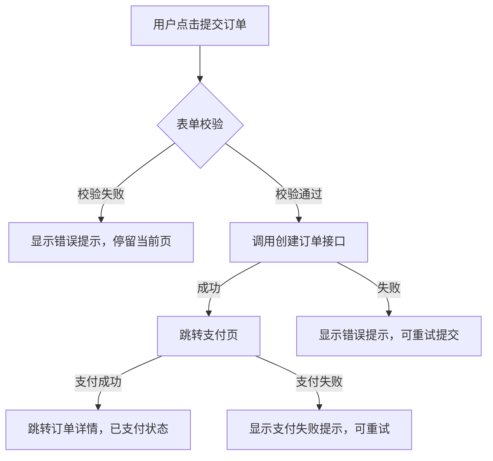
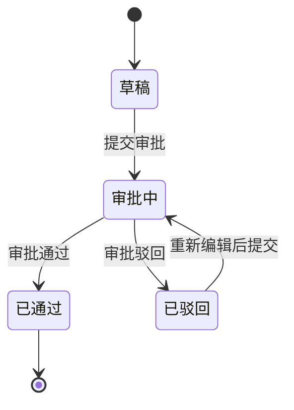

# Requirement.md 模板结构

本文档定义了 requirement.md 的完整章节结构。每个章节包含输出格式和代码提取指引。

---

## 文件头部

```markdown
# Requirement: [产品/Demo 名称]

> 文件命名规则: `PM_Requirement/Requirement_[版本号]/[项目名]_requirement_[版本号].md`，项目名从 package.json 的 `name` 字段或目录名提取，使用 PascalCase 格式。`[版本号]` 格式为 `MMDDNNN`（MM/DD = 系统当前月日，NNN = 当天交付序号从 001 起递增），**必须取系统真实当前日期，禁止从对话上下文、已有文件名推断日期**。例如 `PM_Requirement/Requirement_0721002/AIPPT_requirement_0721002.md`。

<!--
@meta
version: [交付版本号，如 0622001]
delivery-root: PM_Requirement
delivery-folder: PM_Requirement/Requirement_[版本号]
delivery-type: full | incremental
baseline-version: none | [上一交付版本号]
last-updated: [ISO 日期时间，格式 YYYY-MM-DD HH:mm:ss]
last-full-rewrite: [ISO 日期时间，仅全量模式时更新]
update-mode: full-rewrite | incremental | full-refresh
source-hash: [所有源文件路径+大小的哈希值]
analyzed-files: [分析的文件列表，逗号分隔]
target-device: pc | mobile | responsive | hybrid-app | mini-program
@/meta
-->

> 本文档由 demotomd skill 从 demo 代码中反向生成。
> 它精确描述了 demo 中实际体现的产品逻辑和业务意图，而非线上实现方案。
> 当前 demo 是产品经理用于业务确认的本地演示项目，不代表可直接部署的生产工程。
> demo 前端交互、页面流程、字段和状态通常可作为正式产品体验参考。
> demo 后端、接口、数据、权限、大模型调用等通常是 mock 或简化实现，只作为业务规则线索，不作为研发实现参考。
> 研发同学可将此文档直接提供给 AI 编程工具作为开发需求输入。
> 操作可交互 demo + 阅读本文档 = 完整理解产品需求。

---

## 文档目的

[说明本文档是 demo 代码的反向工程产物，用于研发 AI 工具的需求输入。]

### 版本说明

| 项 | 内容 |
|----|------|
| 本次交付版本 | PM_Requirement/Requirement_[版本号] |
| 交付类型 | full / incremental |
| 基线版本 | none / Requirement_[上一版本号] |
| 增量规则 | 如果是 incremental，本文件只描述相对基线版本的新增、变更、废弃和待确认内容；未提及内容默认沿用基线版本。 |

### Demo 与正式项目边界

| 类型 | demo 中的含义 | 正式项目要求 |
|------|--------------|--------------|
| 前端页面与交互 | 代表 PM 和业务确认过的操作体验 | 尽量保留主流程和交互意图，由 UI/研发优化细节 |
| 后端/API/数据 | 多为演示闭环所需的 mock、写死或简化逻辑 | 由研发重新设计接口、数据模型、权限、异常处理和服务能力 |
| 大模型/知识库结果 | 可能是静态示例或伪返回 | 需正式接入模型、提示词、知识库、内容安全和降级策略 |
| 权限与登录 | 可能仅为前端隐藏或固定账号 | 需接入统一登录、角色权限、接口级鉴权和审计 |
```

**提取方式**: 项目名称从 `package.json` 的 `name` 字段或 `<title>` 标签提取。

---

## 第 1 章：产品概述

### 1.1 产品描述

[一段话描述产品是什么、解决什么问题]

**提取方式**: 从 README.md、`<title>` 标签、路由根组件的整体结构推断。

### 1.2 目标用户

[产品的目标用户群体]

**提取方式**: 从表单字段（如角色选择器）、UI 中的用户称呼、权限相关代码推断。

### 1.3 目标设备

| 设备类型 | 说明 |
|----------|------|
| [PC / 移动端 / PC+移动端自适应 / 混合App / 小程序] | [具体的设备要求和适配范围] |

**示例**:

| 设备类型 | 说明 |
|----------|------|
| PC | 桌面端 Web 应用，主要在 1280px+ 屏幕使用 |
| 移动端 | 手机端 H5，主要在 375px 宽度使用 |
| PC+移动端自适应 | 同时支持桌面和移动端，需响应式设计 |
| 混合App | 基于 WebView 的混合应用，需适配 iOS 和 Android |
| 小程序 | 微信/支付宝等小程序平台 |

**提取方式**: 从 `viewport` meta 标签、CSS 媒体查询断点、移动端 UI 库（vant/ant-design-mobile）、响应式框架（Tailwind 断点）、混合 App 框架（Capacitor/Cordova）、小程序框架（uni-app/taro）中综合判断。

**多端行为一致性要求**（若 target-device 涉及多端）：

| 端/设备 | 差异点 | 一致性要求 |
|---------|--------|-----------|
| PC | [如鼠标 hover、宽屏多栏布局、键盘快捷键] | [PC 独有交互，以及需与移动端对齐的行为] |
| 移动端 | [如触摸操作、窄屏单栏、手势返回] | [移动端独有交互，以及与 PC 的行为对齐点] |
| 混合App/小程序 | [如原生能力调用、平台限制] | [与 Web 端的行为差异与对齐要求] |

> 目标设备为单一端时本表填"不适用"；多端时需明确各端功能/交互/数据是否一致，不一致处单独列出。

---

## 第 2 章：页面结构与导航

### 2.1 页面清单

| 路由路径 | 页面名称 | 源文件 | 功能说明 |
|----------|----------|--------|----------|
| `/` | 首页 | `src/pages/Home.tsx` | [功能描述] |
| `/login` | 登录 | `src/pages/Login.tsx` | [功能描述] |
| ... | ... | ... | ... |

**提取方式**: 从路由配置（React Router / Vue Router / Angular Router / 原生 HTML 文件结构）中提取页面映射。

### 2.2 导航关系

[描述页面之间的导航关系：用户从哪个页面可以到达哪个页面，通过什么操作触发导航]

**提取方式**: 收集所有 `useNavigate()` 调用、`<Link to=...>` 组件、`window.location` 跳转、`<a href>` 链接。

### 2.3 页面间参数传递

[描述跨页面传递的参数及其规则]

| 来源页面 | 目标页面 | 传递参数 | 传递方式 | 参数说明 |
|----------|----------|----------|----------|----------|
| 列表页 | 详情页 | `id` | URL 参数 | 选中记录的唯一标识 |
| 创建页 | 列表页 | `created` | URL Query | 标记新建成功，触发列表刷新 |
| ... | ... | ... | ... | ... |

**提取方式**: 从路由参数定义（`useParams`、`this.$route.params`）、URL query 读取（`useSearchParams`、`URLSearchParams`）、导航时携带的参数中提取。

---

## 第 3 章：功能逻辑

每个功能（页面/流程）独立一节。功能划分优先按路由对应的页面，跨页面的流程单独成节。

### 3.N: [功能名称]

#### 3.N.1 功能目的

[一段话描述这个功能解决什么问题、在产品中的角色]

**提取方式**: 从页面组件的整体逻辑和用途推断。

#### 3.N.2 操作流程（多步骤/多分支场景）

当功能涉及多步骤操作或存在条件分支时，必须用 **mermaid 流程图**描述（可被 GitHub / 飞书 / 多数 Markdown 编辑器直接渲染）：



> 简单的单步操作无需流程图。流程图聚焦"多步骤 / 有条件分支 / 有异步结果（成功/失败）"的场景。

**提取方式**: 分析事件处理函数中的完整逻辑链（条件分支、API 调用、导航跳转、错误处理），用 mermaid `flowchart` 描述节点与分支。

#### 3.N.3 状态机（多状态流转场景）

当功能涉及多个状态之间的流转时（如审批流、订单状态、工作流），必须用 **mermaid 状态图**描述：



对每个状态记录：
| 状态 | UI 表现 | 可执行操作 | 转换条件 |
|------|---------|-----------|----------|
| 草稿 draft | 编辑表单可修改 | 编辑、删除、提交审批 | 点击提交→审批中 |
| 审批中 pending | 表单只读，显示审批进度 | 撤回 | 审批人通过→已通过；审批人驳回→已驳回 |
| 已驳回 rejected | 表单可修改，显示驳回原因 | 编辑、重新提交 | 点击重新提交→审批中 |
| 已通过 approved | 只读展示，显示通过时间 | 无 | 终态 |

**提取方式**: 从 `useReducer` 的 action types、`switch-case` 语句、状态变量组合中提取。用 mermaid `stateDiagram-v2` 描述状态与转换，转换条件标注在连线上。

#### 3.N.4 交互规则与元素状态

对每个可交互元素，必须描述其**完整状态**和**交互行为**。状态聚焦"用户能看到/感受到什么"（产品交互表现），不写技术实现（不写 CSS 类名、组件库、事件绑定方式）。

**(1) 元素状态矩阵**（每个元素覆盖以下状态，不适用的标"—"）：

| 元素 | 默认态 | Hover/聚焦 | 点击/激活 | Loading | 禁用 | 报错 | 空态 |
|------|--------|-----------|----------|---------|------|------|------|
| 提交按钮 | 蓝色可点击 | 颜色加深 | 点击后立即进入 loading | 显示 spinner，文案变"提交中" | 表单未通过校验时灰色不可点 | 提交失败恢复可点 + 显示错误提示 | — |
| 手机号输入框 | 空白 + placeholder | 蓝色边框聚焦 | 输入数字 | — | — | 格式错误时红框 + "请输入正确的手机号" | — |
| 搜索框 | placeholder "请输入" | 蓝色边框 | 实时过滤列表 | — | — | — | 无结果时显示"未找到匹配结果" |
| 列表 | 展示数据 | 行高亮 | 选中勾选 | 骨架屏 | — | 错误提示 + 重试 | 空状态插图 + 创建入口 |

**(2) 交互行为规则**（每个元素的触发与后续）：

| 元素 | 触发条件 | 行为 | 前置条件 | 后续效果 |
|------|----------|------|----------|----------|
| 提交按钮 | 点击 | 提交表单 | 表单校验通过、未在提交中 | 成功→跳转列表页；失败→报错可重试 |
| 搜索输入框 | 输入（防抖） | 实时过滤列表 | 已加载数据 | 输入为空时显示全部 |
| 删除按钮 | 点击 | 弹出确认对话框 | 用户有删除权限 | 确认后删除并刷新列表 |

**提取方式**: 分析所有事件处理函数（onClick, onChange, onSubmit 等）+ 状态变量（isLoading / isDisabled / isError / isEmpty / isFocused / isHovered）+ 条件渲染，逐元素列出全部状态。

#### 3.N.5 校验规则

| 字段/输入 | 规则 | 错误提示 | 校验时机 |
|-----------|------|----------|----------|
| 手机号 | 11位数字，1开头 | "请输入正确的手机号" | 失焦时 |
| 密码 | ≥8位，含大小写和数字 | "密码强度不足" | 提交时 |
| 邮箱 | 合法邮箱格式 | "请输入正确的邮箱" | 失焦时 |

**提取方式**: 从 zod/yup schema、自定义校验函数、`pattern` 属性中提取。

#### 3.N.6 极限场景与异常处理

> **重点章节**。每个功能必须覆盖以下 5 类极限场景。

**A. 内容溢出场景**

| 场景 | 当前demo处理 | 产品要求 |
|------|-------------|----------|
| 列表数据过多（>1000条） | [demo中的处理方式] | 分页加载/虚拟滚动/懒加载 |
| 文本内容过长 | [demo中的处理方式] | 单行省略或截断+「查看更多」 |
| 标签/选项过多 | [demo中的处理方式] | 折叠显示+「展开更多」 |

**B. 空内容/无数据场景**

| 场景 | 当前demo处理 | 产品要求 |
|------|-------------|----------|
| 首次使用无数据 | [demo中的处理方式] | 展示引导空状态+创建入口 |
| 搜索无结果 | [demo中的处理方式] | 显示"未找到匹配结果"+建议 |
| 删除最后一项 | [demo中的处理方式] | 显示空状态，而非空白页 |

**C. 网络与接口异常场景**

| 场景 | 当前demo处理 | 产品要求 |
|------|-------------|----------|
| 网络断开 | [demo中的处理方式] | 全局提示+恢复后自动重连 |
| 请求超时 | [demo中的处理方式] | 提示超时+重试按钮 |
| 接口返回错误 | [demo中的处理方式] | 根据状态码显示对应提示 |
| 接口返回数据为空/null | [demo中的处理方式] | 降级为默认值或空状态 |

**D. 用户操作异常场景**

| 场景 | 当前demo处理 | 产品要求 |
|------|-------------|----------|
| 表单重复提交 | [demo中的处理方式] | 提交后禁用按钮+loading（前端防抖） |
| 页面刷新丢失数据 | [demo中的处理方式] | 未保存提示或自动存草稿 |
| 浏览器后退/前进 | [demo中的处理方式] | 弹窗确认（如有未保存修改） |

**E. 并发与竞态场景**

| 场景 | 当前demo处理 | 产品要求 |
|------|-------------|----------|
| 两人同时编辑同一记录 | [demo中的处理方式] | 乐观锁/版本号检测，后提交者提示"数据已被他人修改" |
| 库存/名额并发扣减 | [demo中的处理方式] | 原子扣减，防止超卖/超领，超限时明确提示 |
| 并发状态变更冲突 | [demo中的处理方式] | 状态前置校验，非法转换被拒绝并提示 |
| 同一资源并发创建 | [demo中的处理方式] | 幂等键去重，重复请求只创建一条 |

**提取方式**: 从代码中的 `try/catch`、`isLoading`/`isError` 状态、`debounce`/`throttle`、`beforeunload` 监听、空数组判断、超时处理、乐观锁/版本号/幂等键机制中提取。对于代码中未处理的极限场景，主动标注"代码中未处理，需补充"。

#### 3.N.7 验收标准（Definition of Done）

> 面向研发和研发 Agent，定义该功能"完成"的标准。每条 AC 是一个**能力达成判据**——研发实现到"该判据成立"即视为该能力完成。这里只写"能力达成后的可观测结果"，不写测试步骤（可执行测试用例见测试文档第 2 章，避免重复）。

| 编号 | 能力点（要具备什么能力） | 完成判据（可观测的达成标志） | 优先级 |
|------|--------------------------|------------------------------|--------|
| AC-1 | [如"用户能成功创建订单"] | [如"提交后订单出现在列表且状态为待审核"] | P0 |
| AC-2 | [如"必填字段缺失时阻止提交"] | [如"对应字段下方显示具体错误文案，不发起请求"] | P0 |
| AC-3 | [如"订单超过30天未审核自动取消"] | [如"超期后状态变为已取消，不可再审批"] | P1 |

**完成判据要求（借鉴断言化思路，用研发视角）**：
- 判据必须可观测、可判定（描述"达成后能看到什么 / 系统处于什么状态"），**禁止模糊词**（正常 / 正确 / 符合预期 / 合理）
- 不写测试步骤与测试数据（那是测试文档第 2 章），只写"能力达成后的可观测结果"

**覆盖维度**（每个功能至少覆盖）：
- **正向路径**：核心业务流程能跑通到预期终态
- **逆向路径**：异常输入 / 操作得到合理反馈
- **边界条件**：极限数据量、特殊字符、空值等有处理
- **状态约束**：状态机每个状态的可达操作与终态正确
- **权限能力**：每个角色具备 / 不具备的能力边界清晰

**提取方式**: 从功能的操作流程、交互规则、校验规则、极限场景、状态机、权限规则中提炼"能力达成判据"。每个正向路径至少 1 条，每个状态终态、每个权限角色边界至少 1 条。

#### 3.N.8 登录态与可见性差异

> 高频遗漏点：同一个页面/功能，在未登录、token 过期、不同角色下表现往往不同，必须逐一说明，不能只写"已登录管理员"的视角。

| 状态 | 该功能可见性 | 可操作性 | 差异说明 |
|------|-------------|----------|----------|
| 未登录 | [如"跳转登录页" / "显示登录引导" / "不可见"] | [不可用 / 仅可预览] | [具体差异] |
| 已登录 - token 有效 | 正常显示 | 完整可用 | — |
| 已登录 - token 过期 | [如"操作时跳转登录，登录后回原页"] | [操作被拦截] | [具体差异] |
| 角色 A（如管理员） | [可见范围] | [可操作范围] | |
| 角色 B（如普通用户） | [可见范围] | [可操作范围] | |
| 角色 C（如游客） | [可见范围] | [可操作范围] | |

**提取方式**: 从路由守卫、登录态判断（isAuthenticated / token）、角色判断（role / permission）、条件渲染（未登录时显示什么、过期时跳转到哪）中提取。token 过期处理从请求拦截器 / 401 处理 / 登录失效逻辑中识别。

---

## 第 4 章：业务规则

### 4.1 计算规则

[所有业务相关的计算逻辑]

| 计算项 | 输入 | 公式/逻辑 | 输出 |
|--------|------|-----------|------|
| 总价 | 单价 × 数量 × 折扣 | `单价 × 数量 × (1 - 折扣/100)` | 金额 |
| 折扣门槛 | 订单金额 | 满200减20，满500减60 | 折扣金额 |

### 4.2 条件逻辑

[所有控制 UI 展示/隐藏/启用/禁用的业务规则]

| 规则名称 | 条件描述（自然语言） | 效果 | 适用场景 |
|----------|---------------------|------|----------|
| 管理员可见 | 用户角色为"管理员" | 显示管理菜单 | 全局导航 |
| 已登录隐藏 | 用户已登录 | 隐藏登录/注册入口 | Header |
| 审批中禁用编辑 | 单据状态为"审批中" | 禁用编辑和删除按钮 | 详情页 |

### 4.3 数据处理规则

[数据的排序、过滤、分组、格式化规则]

| 操作 | 规则描述 |
|------|----------|
| 列表默认排序 | 按创建时间倒序，最新的在前 |
| 搜索过滤 | 支持按名称模糊搜索，实时过滤（输入防抖300ms） |
| 日期展示格式 | YYYY年MM月DD日 HH:mm |
| 金额展示格式 | 千分位分隔，保留2位小数，带货币符号 |

---

## 第 5 章：数据模型

> 本章描述 demo 中涉及的数据结构和 mock 数据情况，不涉及具体技术实现。

### 5.1 核心数据实体

对每个核心业务实体，描述其字段：

```markdown
### [实体名称: 如"用户"]

| 字段 | 类型 | 必填 | 说明 |
|------|------|------|------|
| id | string | 是 | 唯一标识 |
| name | string | 是 | 用户名 |
| ... | ... | ... | ... |
```

**提取方式**: 从 TypeScript 接口定义、PropTypes 声明中提取。

### 5.2 Mock 数据说明

> 明确告知研发哪些数据是 demo 中的模拟数据，需要对接真实数据源。

| 数据/功能 | Demo 中的模拟方式 | 正式实现要求 |
|-----------|-------------------|-------------|
| 用户列表 | 本地 JSON 文件，20条固定数据 | 对接后端分页接口，支持搜索过滤 |
| 登录认证 | 固定账号密码，内存存储 token | 对接 SSO/OAuth，token 持久化 |
| 文件上传 | 模拟延迟，不真正上传 | 对接 OSS/S3，支持进度条和断点续传 |

**提取方式**: 从 mock 文件、硬编码数据、`setTimeout` 模拟中识别。

### 5.3 后端与服务能力正式实现要求

> 本节不描述 demo 后端代码如何实现，只描述正式系统需要具备的服务能力。

| 能力/场景 | 当前 demo 表现 | 正式实现要求 | 需确认事项 |
|-----------|---------------|--------------|------------|
| 登录认证 | 固定账号或本地 token | 对接统一登录、token 续期、退出登录、登录失效跳转 | 账号体系、角色来源 |
| 权限控制 | 前端根据角色隐藏按钮 | 后端接口级鉴权，前端只做体验层控制 | 角色矩阵、数据范围 |
| 数据查询 | 本地数组或 JSON | 后端分页、搜索、筛选、排序接口 | 查询条件、分页规则 |
| AI 生成 | 写死返回或 mock 文案 | 对接大模型、提示词、知识库、内容安全审核、失败降级 | 模型来源、知识库范围、审核规则 |
| 文件处理 | 本地预览或假上传 | 对接文件服务，支持上传进度、失败重试、权限校验 | 文件类型、大小限制、存储周期 |

**接口能力清单（业务级，不写 URL / HTTP 方法 / 请求体结构）**：

| 接口能力 | 触发场景 | 输入业务字段 | 输出业务结果 | 权限要求 |
|----------|----------|--------------|--------------|----------|
| [能力名] | [何时调用] | [业务字段] | [成功结果] | [角色/登录态] |

**错误场景与错误码（业务级枚举，不写 HTTP 状态码）**：

| 错误场景 | 业务含义 | 用户可见提示 | 正式实现要求 |
|----------|----------|--------------|--------------|
| 参数错误 | 必填缺失 / 格式不符 / 越界 | 定位到具体字段并高亮 | 后端逐字段校验，返回字段级错误 |
| 无权限 | 角色无此操作权 | 隐藏入口或提示无权限 | 接口级鉴权，不依赖前端隐藏 |
| 资源不存在 | 目标已删除 / 下架 | 友好提示而非报错 | 软删除 / 状态校验 |
| 冲突 | 并发或重复提交 | 提示数据已被修改或已提交 | 乐观锁 / 幂等键 |
| 超时 | 请求超时 | 超时提示 + 重试 | 超时阈值 + 重试策略 |
| 外部依赖失败 | 大模型 / 文件服务不可用 | 降级提示 | 熔断 / 降级 / 重试 |

**性能要求（业务级，不写 QPS / 内存等技术指标；demo 通常未实现，标注需产品补充数值）**：

| 场景 | demo 表现 | 业务性能要求 | 需补充数值 |
|------|-----------|--------------|-----------|
| 列表加载 | mock 数据瞬时返回 | [N 条数据 X 秒内加载完毕] | [需产品补充具体条数和秒数] |
| 搜索响应 | 前端内存过滤 | [输入后 X 秒内出结果] | [需产品补充] |
| 导出 / 批量操作 | 未实现或瞬时 | [N 条数据 X 秒内完成] | [需产品补充] |
| 大模型生成 | 写死返回 | [首次响应 X 秒内，完整生成 X 秒内] | [需产品补充] |

**提取方式**: 从 demo 中的 server/API route、service、mock 函数、硬编码返回、localStorage、固定账号、大模型伪返回中识别。只提取业务能力，不复用 demo 后端结构、URL、HTTP 方法或临时数据存储方式。接口/错误/性能要求从业务流程推断，技术错误码枚举下沉到可选 `_server_requirement.md`。

---

## 第 6 章：已知缺口与待办

> 明确告知研发哪些是 demo 中的简化实现、硬编码或未完成功能。

### 6.1 简化逻辑

| 功能 | Demo 实现 | 生产要求 |
|------|-----------|----------|
| 登录 | 固定账号密码即可登录 | 对接 SSO/OAuth |
| 权限 | 仅前端隐藏菜单 | 后端接口级鉴权 |
| 搜索 | 前端内存过滤 | 后端全文搜索 |

### 6.2 缺失功能

| 功能 | 状态 | 预期行为 |
|------|------|----------|
| 导出 Excel | 按钮 disabled | 点击后下载筛选后的数据 |
| 批量操作 | UI 存在但无逻辑 | 勾选后可批量删除/修改状态 |

### 6.3 TODO / FIXME 注释

| 注释 | 文件 | 说明 |
|------|------|------|
| `// TODO: 添加分页逻辑` | `UserList.tsx` | 当前只显示前20条 |

**提取方式**: 搜索所有 TODO、FIXME、HACK、XXX 注释。

---

## 第 7 章：数据埋点

> 先逐个写清每个埋点事件，再在 7.5 节给出监控指标与计算逻辑。每个埋点事件必须能回答六个问题：**在哪个页面？上报哪些字段？字段什么类型？中文什么含义？什么时候上报？哪些是关键字段？** 所有事件列完后，第 7.5 节用事件 ID + 字段名写出每个监控指标的计算逻辑。

### 7.1 埋点事件总表

> 全局事件清单，一眼看清有哪些埋点、归属哪个页面、什么类型、何时上报、关键字段是什么。事件 ID 在 7.5 节指标计算逻辑中被引用，必须唯一。

| 事件 ID | 所属页面 | 事件名 | 事件中文 | 事件类型 | 上报时机 | 关键字段 |
|---------|----------|--------|----------|----------|----------|----------|
| E-01 | 首页 | `page_home_view` | 首页浏览 | 页面浏览 | 首屏渲染完成 | source_channel, is_new_user |
| E-02 | 商品列表 | `page_product_list_view` | 商品列表浏览 | 页面浏览 | 列表首屏数据加载完成 | category_id, filter, result_count |
| E-03 | 商品详情 | `page_product_detail_view` | 商品详情浏览 | 页面浏览 | 详情数据加载完成 | product_id, from_page |
| E-04 | 全局 | `action_search` | 搜索提交 | 用户行为 | 点击搜索、校验通过、发起请求前 | keyword, result_count |
| E-05 | 商品详情 | `action_add_cart` | 加入购物车 | 用户行为 | 点击加购、校验通过后 | product_id, quantity, price |
| E-06 | 购物车 | `action_submit_order` | 提交订单 | 用户行为 | 订单校验通过、发起下单前 | order_amount, item_count, pay_method |
| E-07 | 注册页 | `event_register_success` | 注册成功 | 业务事件 | 注册接口返回成功 | user_id, channel |
| E-08 | 支付页 | `event_payment_success` | 支付成功 | 业务事件 | 支付回调确认成功 | order_id, amount, pay_method |
| E-09 | 审批详情 | `event_approval_pass` | 审批通过 | 业务事件 | 审批状态变更为通过 | approval_id, approver_id, cost_ms |

**提取方式**: 全局梳理所有埋点事件，统一编号（E-01 起）。事件类型分三类：页面浏览 / 用户行为 / 业务事件。事件名用 `类型_对象_动作` 下划线小写格式（page_ / action_ / event_ 前缀区分类型）。

### 7.2 页面浏览埋点（逐事件字段明细）

> 对 7.1 中每个页面浏览事件，逐字段写清：字段名、字段类型、中文含义、是否关键字段、取值来源。字段类型用 string / number / boolean / datetime / object / array。

**事件 `page_home_view`（首页浏览，E-01）**

| 字段名 | 字段类型 | 中文含义 | 是否关键字段 | 取值来源 |
|--------|----------|----------|--------------|----------|
| page_id | string | 页面标识 | 是 | 路由常量 |
| source_channel | string | 来源渠道 | 是 | url query / 上级页透传 |
| is_new_user | boolean | 是否新用户 | 是 | 用户服务返回 |
| load_duration_ms | number | 首屏耗时(毫秒) | 否 | performance API |

- **上报时机**：首页首屏渲染完成（非一进入路由就报，需等核心内容渲染完毕）

**事件 `page_product_list_view`（商品列表浏览，E-02）**

| 字段名 | 字段类型 | 中文含义 | 是否关键字段 | 取值来源 |
|--------|----------|----------|--------------|----------|
| page_id | string | 页面标识 | 是 | 路由常量 |
| category_id | string | 分类 ID | 是 | url query / 默认分类 |
| filter | object | 筛选条件 | 是 | 筛选器状态 |
| sort | string | 排序方式 | 否 | 排序器状态 |
| result_count | number | 商品总数 | 是 | 列表接口返回 |

- **上报时机**：列表首屏数据加载完成

**事件 `page_product_detail_view`（商品详情浏览，E-03）**

| 字段名 | 字段类型 | 中文含义 | 是否关键字段 | 取值来源 |
|--------|----------|----------|--------------|----------|
| product_id | string | 商品 ID | 是 | url query |
| from_page | string | 来源页面 | 是 | 上级页路由 |
| sku_id | string | SKU ID | 否 | 默认选中规格 |

- **上报时机**：详情数据加载完成

**提取方式**: 从页面路由和加载逻辑中提取。取值来源必须写清来自 url / 接口返回 / 本地状态 / performance API，不能笼统写"前端"。

### 7.3 用户行为埋点（逐事件字段明细）

**事件 `action_search`（搜索提交，E-04）**

| 字段名 | 字段类型 | 中文含义 | 是否关键字段 | 取值来源 |
|--------|----------|----------|--------------|----------|
| keyword | string | 搜索关键词 | 是 | 输入框值 |
| result_count | number | 搜索结果数 | 是 | 搜索接口返回 |
| search_source | string | 搜索入口 | 否 | 触发位置(顶栏/中心页) |

- **上报时机**：用户点击搜索按钮、前端校验通过、发起搜索请求前

**事件 `action_add_cart`（加入购物车，E-05）**

| 字段名 | 字段类型 | 中文含义 | 是否关键字段 | 取值来源 |
|--------|----------|----------|--------------|----------|
| product_id | string | 商品 ID | 是 | 商品上下文 |
| quantity | number | 加购数量 | 是 | 数量选择器 |
| price | number | 单价(分) | 是 | 商品详情 |
| sku_id | string | SKU ID | 否 | 选中规格 |

- **上报时机**：点击加购按钮、库存与校验通过后、发起加购请求前

**事件 `action_submit_order`（提交订单，E-06）**

| 字段名 | 字段类型 | 中文含义 | 是否关键字段 | 取值来源 |
|--------|----------|----------|--------------|----------|
| order_amount | number | 订单总金额(分) | 是 | 订单计算 |
| item_count | number | 商品件数 | 是 | 购物车选中项 |
| pay_method | string | 支付方式 | 是 | 支付方式选择 |
| coupon_id | string | 优惠券 ID | 否 | 选中优惠券 |

- **上报时机**：订单校验通过、发起下单请求前

**提取方式**: 从关键交互事件（onClick、onSubmit）中提取，优先覆盖核心指标相关行为。金额类字段统一存最小货币单位（分）避免浮点误差。

### 7.4 业务事件埋点（逐事件字段明细）

**事件 `event_register_success`（注册成功，E-07）**

| 字段名 | 字段类型 | 中文含义 | 是否关键字段 | 取值来源 |
|--------|----------|----------|--------------|----------|
| user_id | string | 用户 ID | 是 | 注册接口返回 |
| channel | string | 注册渠道 | 是 | 落地页透传 |
| invite_code | string | 邀请码 | 否 | url query |
| cost_ms | number | 注册流程耗时(毫秒) | 否 | 前端计时 |

- **上报时机**：注册接口返回成功（仅成功时上报，失败走单独的报错事件）

**事件 `event_payment_success`（支付成功，E-08）**

| 字段名 | 字段类型 | 中文含义 | 是否关键字段 | 取值来源 |
|--------|----------|----------|--------------|----------|
| order_id | string | 订单 ID | 是 | 订单上下文 |
| amount | number | 支付金额(分) | 是 | 支付结果 |
| pay_method | string | 支付方式 | 是 | 用户选择 |
| cost_ms | number | 支付耗时(毫秒) | 否 | 发起→回调计时 |

- **上报时机**：支付回调确认成功

**事件 `event_approval_pass`（审批通过，E-09）**

| 字段名 | 字段类型 | 中文含义 | 是否关键字段 | 取值来源 |
|--------|----------|----------|--------------|----------|
| approval_id | string | 审批单 ID | 是 | 审批上下文 |
| approver_id | string | 审批人 ID | 是 | 当前用户 |
| cost_ms | number | 审批耗时(毫秒) | 是 | 提交→通过计时 |
| result | string | 审批结果 | 是 | 状态机终态(通过) |

- **上报时机**：审批状态机变更为"通过"终态

**提取方式**: 从状态机流转的终态达成、核心业务流程的完成节点中提取。失败/异常态单独建事件，不与成功事件混在一条。

### 7.5 监控指标与计算逻辑

> 所有埋点事件列完后，在此定义要监控的具体指标及其计算逻辑。计算逻辑必须用 7.1 的事件 ID 和字段名表达，保证可追溯、可核对。

| 指标名称 | 指标中文 | 计算逻辑 | 监控维度 | 目标值 | 关联事件 |
|----------|----------|----------|----------|--------|----------|
| register_rate | 注册转化率 | count(E-07) / count(E-01 中 source_channel 指向注册的 UV) | 按渠道 channel | ≥30% | E-01, E-07 |
| search_hit_rate | 搜索命中率 | count(E-04 中 result_count > 0) / count(E-04) | 按搜索入口 | ≥60% | E-04 |
| cart_to_order | 加购→下单转化率 | count(E-06) / count(E-05) | 按商品分类 | ≥20% | E-05, E-06 |
| payment_success_rate | 支付成功率 | count(E-08) / count(E-06) | 按支付方式 | ≥95% | E-06, E-08 |
| avg_approval_cost | 平均审批时效 | avg(E-09.cost_ms) | 按审批类型 | ≤24h | E-09 |
| dau | 日活用户数 | count(distinct user_id) per day，取当日任一行为事件去重 | 按日 | ≥1000 | E-01~E-04 |

**提取方式**: 从第 7.1~7.4 的事件与字段反推指标。每个指标必须：① 用事件 ID + 字段写出可执行的计算逻辑；② 标注监控维度（按渠道/分类/支付方式/时间）；③ 给目标值（产品补充）；④ 列关联事件 ID，便于核对数据源是否齐全。

---

## 变更日志

| 日期 | 模式 | 版本 | 变更摘要 |
|------|------|------|----------|
| [日期] | full-rewrite | 1.0 | 初始生成 |

---

# [项目名]_server_requirement.md 模板结构

> 可选文档。仅当项目检测到真实服务端/数据库能力，且用户确认线上正式项目使用相同技术栈并需要输出时生成。
> 面向后端研发和后端 Agent，描述服务端能力、数据模型、数据库改造、权限、异常和集成要求。
> 文件命名：`PM_Requirement/Requirement_[版本号]/[项目名]_server_requirement_[版本号].md`，例如 `PM_Requirement/Requirement_0622001/AIPPT_server_requirement_0622001.md`。

---

## 文件头部

```markdown
# Server Requirement: [产品/Demo 名称]

<!--
@meta
version: [交付版本号，如 0622001]
delivery-root: PM_Requirement
delivery-folder: PM_Requirement/Requirement_[版本号]
delivery-type: full | incremental
baseline-version: none | [上一交付版本号]
last-updated: [ISO 日期时间，格式 YYYY-MM-DD HH:mm:ss]
last-full-rewrite: [ISO 日期时间，仅全量模式时更新]
update-mode: full-rewrite | incremental | full-refresh
source-hash: [服务端与数据库相关源文件路径+大小的哈希值]
analyzed-files: [分析的服务端/数据库文件列表，逗号分隔]
server-mode: production-stack
confirmed-stack: [用户确认的线上同技术栈说明]
@/meta
-->

> 本文档由 demotomd skill 从包含服务端/数据库能力的项目中反向生成。
> 仅在用户确认线上正式项目采用相同技术栈并需要服务端文档时生成。
> 本文档描述服务端业务能力和数据库改造要求，不直接要求研发逐行照搬当前代码。
```

---

## 第 1 章：服务端范围与技术栈确认

### 1.1 检测到的技术栈

| 类型 | 检测结果 | 证据文件 |
|------|----------|----------|
| 服务端框架 | [如 NestJS / FastAPI / Spring Boot] | [文件路径] |
| ORM/数据访问 | [如 Prisma / SQLAlchemy / JPA] | [文件路径] |
| 数据库 | [如 PostgreSQL / MySQL / MongoDB] | [配置或迁移文件] |
| 外部依赖 | [如 Redis / 队列 / 文件服务 / AI 服务] | [文件路径] |

### 1.2 用户确认结果

| 确认项 | 结果 |
|--------|------|
| 是否来自线上项目 | 是 / 否 / 未确认 |
| 线上是否同技术栈 | 是 / 否 / 未确认 |
| 是否需要输出服务端需求 | 是 |
| 不确定事项 | [需要 PM 或研发补充的问题] |

---

## 第 2 章：API/服务能力清单

> 按业务能力描述，不强制研发沿用当前 URL、HTTP 方法或代码结构。

| 能力名称 | 触发场景 | 输入业务字段 | 输出结果 | 权限要求 | 异常结果 |
|----------|----------|--------------|----------|----------|----------|
| 创建订单 | 用户提交订单 | 商品、数量、收货信息 | 订单创建成功，状态为待审核 | 已登录用户 | 商品不存在、库存不足、重复提交 |

---

## 第 3 章：数据模型与数据库改造

### 3.1 核心表/实体

| 表/实体 | 业务含义 | 关键字段 | 关系 |
|---------|----------|----------|------|
| orders | 订单 | id, status, total_amount, created_by | 关联用户、订单明细 |

### 3.2 字段与约束

| 表/实体 | 字段 | 类型 | 必填 | 约束/索引 | 说明 |
|---------|------|------|------|-----------|------|
| orders | status | string/enum | 是 | 索引 | 订单状态 |

### 3.3 数据库迁移与兼容

| 改造项 | 当前实现 | 迁移要求 | 兼容/回滚风险 |
|--------|----------|----------|----------------|
| 新增字段 | [字段] | 需要默认值/回填历史数据 | 老数据为空时的处理 |

---

## 第 4 章：服务端业务规则

| 规则类型 | 规则描述 | 适用能力 | 失败处理 |
|----------|----------|----------|----------|
| 权限规则 | 用户只能查看自己创建的数据，管理员可查看全部 | 查询列表、详情 | 返回无权限提示 |
| 幂等规则 | 重复提交同一请求只能创建一条记录 | 创建接口 | 返回已有结果或明确提示 |

---

## 第 5 章：外部依赖与集成能力

| 依赖 | 用途 | 输入/输出 | 失败降级 | 待确认 |
|------|------|-----------|----------|--------|
| 大模型服务 | 生成内容 | 输入用户材料，输出生成结果 | 超时提示，可重试 | 模型、提示词、安全策略 |
| 知识库 | 检索教材资源 | 输入关键词，返回引用片段 | 无结果时提示补充材料 | 数据范围、更新频率 |

---

## 第 6 章：异常与降级策略

| 异常场景 | 处理要求 | 前端提示/测试关注 |
|----------|----------|-------------------|
| 参数错误 | 返回具体字段错误 | 表单字段高亮 |
| 无权限 | 返回无权限结果，不泄露数据 | 按钮隐藏或提示无权限 |
| 并发冲突 | 检测版本或更新时间 | 提示数据已被他人修改 |
| 外部服务超时 | 记录日志，支持重试或降级 | 显示超时提示 |

---

## 第 7 章：研发交接注意事项

| 类型 | 内容 |
|------|------|
| 可参考点 | [当前项目中已验证的服务端业务规则或数据库结构] |
| 不可照搬点 | [临时代码、调试逻辑、写死配置、演示账号等] |
| 待确认问题 | [接口归属、数据来源、权限口径、迁移策略等] |

---

## version-manifest.md（每个版本目录内生成）

> 每次交付都必须在 `PM_Requirement/Requirement_[版本号]/` 目录中生成本文件，说明本次交付版本与上一版本的关系。

```markdown
# Requirement Version Manifest: PM_Requirement/Requirement_[版本号]

| 项 | 内容 |
|----|------|
| 交付版本 | PM_Requirement/Requirement_[版本号] |
| 交付日期 | YYYY-MM-DD HH:mm |
| 交付类型 | full / incremental |
| 基线版本 | none / Requirement_[上一版本号] |
| 项目名称 | [项目名] |
| Git Commit | abc1234 (dirty) / N/A |

## 本次输出文件

| 文件 | 角色 | 输出原因 |
|------|------|----------|
| [项目名]_requirement_[版本号].md | 研发 | [新增/变更业务规则] |
| [项目名]_ui_requirement_[版本号].md | UI | [新增/变更交互] |
| [项目名]_test_requirement_[版本号].md | 测试 | [新增/变更验收点] |
| [项目名]_server_requirement_[版本号].md | 后端 | [可选，用户确认后输出] |

## 与基线版本的关系

| 类型 | 内容 | 影响文档 |
|------|------|----------|
| 新增 | [本次新增功能/规则] | [文档名] |
| 修改 | [替换基线版本中的哪个规则] | [文档名] |
| 废弃 | [不再适用的旧规则] | [文档名] |
| 沿用 | 未提及内容默认沿用基线版本 | 全部 |

## 跳过说明

| 文档 | 是否跳过 | 原因 |
|------|----------|------|
| 服务端需求文档 | 是/否 | [未检测到真实服务端 / 用户未确认同技术栈 / 本次无服务端变更] |
```

---

## Requirement_log.md（PM_Requirement 下的总日志）

> 每次同步 requirement 文档时，同步更新（追加）`PM_Requirement/[项目名]_Requirement_log.md`。记录每次交付版本，用于回溯和审计。

```markdown
# Requirement Change Log

| 序号 | 时间 | 交付版本 | 输出目录 | 基线版本 | 交付类型 | Git Commit | 输出文件 | 修改内容 |
|------|------|----------|----------|----------|----------|------------|----------|----------|
| 1 | YYYY-MM-DD HH:mm | 0622001 | PM_Requirement/Requirement_0622001 | none | full | abc1234 (dirty) | requirement/ui/test | 初始生成全部需求 |
| 2 | YYYY-MM-DD HH:mm | 0622002 | PM_Requirement/Requirement_0622002 | 0622001 | incremental | def5678 | requirement/test | 新增用户删除确认弹窗；补充删除测试点 |
```

### 字段说明

| 字段 | 说明 |
|------|------|
| 序号 | 自增编号 |
| 时间 | 同步操作的实际时间，精确到分钟 |
| 交付版本 | 本次输出目录的版本号，如 0622002 |
| 输出目录 | 本次 MD 文件所在目录，如 PM_Requirement/Requirement_0622002 |
| 基线版本 | 增量文档依赖的上一版本；首次为 none |
| 交付类型 | full / incremental |
| Git Commit | 当前 HEAD 的短 commit hash。若有未提交的变更追加 ` (dirty)`；若无 git 仓库填 `N/A` |
| 输出文件 | 本次实际输出的文档类型 |
| 修改内容 | 简述具体改了什么，每个变更点用分号分隔 |

### 写入规则

- **追加写入**：新记录追加到表格末尾，不修改已有记录
- **使用 Edit 工具**：在表格最后一行数据后追加新行，不要重写整个文件
- **首次生成**：当文件不存在时，创建文件并写入表头 + 第一条记录

---

# [项目名]_ui_requirement.md 模板结构

> 面向 UI 设计师的交互需求文档，从 demo 代码中提取交互状态、视觉元素清单、交互问题标注。
> 文件命名：`PM_Requirement/Requirement_[版本号]/[项目名]_ui_requirement_[版本号].md`，例如 `PM_Requirement/Requirement_0622001/AIPPT_ui_requirement_0622001.md`。

---

## 文件头部

```markdown
# UI Requirement: [产品/Demo 名称]

<!--
@meta
version: [交付版本号，如 0622001]
delivery-root: PM_Requirement
delivery-folder: PM_Requirement/Requirement_[版本号]
delivery-type: full | incremental
baseline-version: none | [上一交付版本号]
last-updated: [ISO 日期时间，格式 YYYY-MM-DD HH:mm:ss]
last-full-rewrite: [ISO 日期时间，仅全量模式时更新]
update-mode: full-rewrite | incremental | full-refresh
source-hash: [所有源文件路径+大小的哈希值]
analyzed-files: [分析的文件列表，逗号分隔]
target-device: pc | mobile | responsive | hybrid-app | mini-program
@/meta
-->

> 本文档由 demotomd skill 从 demo 代码中反向生成。
> 面向 UI 设计师，描述 demo 中实现的交互逻辑和视觉元素状态。
> 当前 demo 是产品经理用于业务确认的本地演示项目，前端页面、流程和交互状态是 UI 设计的重要参考。
> UI 设计师可基于本文档在 Figma 中复刻接近 demo 的界面，再结合设计规范进行视觉优化。
> 操作可交互 demo + 阅读本文档 = 完整理解交互需求。
```

---

## 第 1 章：页面结构与导航

### 1.1 页面清单

| 路由路径 | 页面名称 | 源文件 | 功能说明 |
|----------|----------|--------|----------|
| `/` | 首页 | `src/pages/Home.tsx` | [功能描述] |
| ... | ... | ... | ... |

### 1.2 导航关系

[页面之间的跳转关系，包括触发方式（点击按钮、返回箭头、自动跳转等）]

### 1.3 页面间参数传递

| 来源页面 | 目标页面 | 传递参数 | 传递方式 | 参数对 UI 的影响 |
|----------|----------|----------|----------|------------------|
| 列表页 | 详情页 | `id` | URL 参数 | 详情页根据 id 展示不同内容 |

---

## 第 2 章：交互状态清单

> 每个页面/功能的所有交互状态，UI 设计师需要为每种状态出设计稿。

### 2.N: [页面/功能名称]

#### 交互状态矩阵

| 交互元素 | 默认态 | Hover/聚焦 | 激活/选中 | 加载中 | 禁用 | 错误 | 空态 |
|----------|--------|-----------|----------|--------|------|------|------|
| 提交按钮 | 蓝色"提交" | 颜色加深 | 点击后变为 loading | 显示 spinner | 灰色不可点 | - | - |
| 搜索框 | placeholder "请输入" | 蓝色边框 | - | - | - | 红色边框+提示 | - |
| 列表 | 数据展示 | 行 hover 高亮 | 选中行勾选 | 骨架屏 | - | 错误提示 | 空状态插图 |
| 标签选择 | 未选中样式 | 背景色变深 | 选中高亮+勾 | - | 灰色不可点 | - | "暂无标签" |

**提取方式**: 从代码中的 `disabled`、`isLoading`、`isError`、`isEmpty`、`isActive`、`isHovered` 等状态变量和条件渲染中提取。

#### 弹窗与浮层清单

| 弹窗名称 | 触发条件 | 内容描述 | 操作按钮 | 关闭方式 |
|----------|----------|----------|----------|----------|
| 删除确认 | 点击删除按钮 | "确定删除选中的 N 条记录？" | 取消 / 确认删除 | 取消 / 点击遮罩 |
| 成功提示 | 操作成功 | "操作成功" | 无 | 3秒自动关闭 |

**提取方式**: 从 Modal/Dialog/Popover/Tooltip/Drawer 组件的使用中提取。

#### 反馈提示清单

| 提示类型 | 触发场景 | 提示内容 | 展示形式 | 持续时间 |
|----------|----------|----------|----------|----------|
| 成功提示 | 提交成功 | "创建成功" | Toast 顶部 | 3秒 |
| 错误提示 | 网络异常 | "网络连接失败，请重试" | Toast 顶部 | 手动关闭 |
| 空状态 | 列表无数据 | "暂无订单，去创建" | 页面内嵌 | 持续 |

**提取方式**: 从 Toast/Notification/Alert 组件的调用中提取。

---

## 第 3 章：视觉元素需求清单

> demo 中需要但未实现、或实现粗糙的视觉元素，UI 设计师需要产出。

### 3.1 Icon 需求清单

| Icon 名称 | 使用位置 | 当前 demo 处理 | 设计要求 |
|-----------|----------|---------------|----------|
| 搜索图标 | 搜索框内 | 使用文字"搜索" | 线性风格，16px |
| 删除图标 | 列表操作列 | 使用 emoji 🗑 | 与整体风格统一的线性图标 |
| 空状态插图 | 空列表页 | 纯文字"暂无数据" | 需要设计空状态插图 |

**提取方式**: 从代码中的 icon 组件使用、emoji、文字替代 icon 的场景中识别。标注 demo 中使用文字/emoji/icon 库但正式版需要设计的。

### 3.2 插图与空状态图

| 位置 | 尺寸建议 | 场景 | 设计要求 |
|------|----------|------|----------|
| 首页空状态 | 200x200 | 首次使用无数据 | 简洁友好，引导创建 |
| 搜索无结果 | 160x160 | 搜索未匹配到内容 | 鼓励调整搜索条件 |

### 3.3 占位图与默认图

| 位置 | 当前 demo 处理 | 设计要求 |
|------|---------------|----------|
| 用户头像 | 使用首字母 | 需默认头像图 |
| 商品图片 | 使用灰色方块 | 需要占位图 |

---

## 第 4 章：交互问题标注

> 从 demo 代码中识别出的交互不合理或缺失之处，需要 UI 设计师在设计稿中修正。

### 4.1 交互逻辑问题

| 页面/功能 | 问题描述 | 当前 demo 行为 | 建议优化方向 |
|-----------|----------|---------------|-------------|
| 订单列表 | 批量删除无二次确认 | 直接删除 | 需确认弹窗，显示选中数量 |
| 表单页 | 退出无未保存提示 | 直接退出 | 弹窗确认"有未保存的修改" |
| 详情页 | 返回按钮位置不统一 | 有的在左上有的在顶部 | 统一返回按钮位置和交互 |

**提取方式**: 对比 demo 代码中的交互实现与通用交互规范，识别不一致或不合理之处。

### 4.2 缺失的交互反馈

| 场景 | 缺失的反馈 | 建议补齐 |
|------|-----------|---------|
| 长时间操作（>1秒） | 无 loading 反馈 | 需要加载动画或进度条 |
| 删除操作 | 无成功反馈 | 需要 Toast 确认 |
| 表单提交失败 | 错误信息不够具体 | 需要定位到具体字段并高亮 |

### 4.3 响应式适配需求

| 页面 | 当前 demo 适配 | 需要适配的设备 |
|------|---------------|---------------|
| 全局 | 仅桌面端 | 需适配平板（768px）和手机（375px） |
| 数据表格 | 固定列宽 | 移动端改为卡片列表 |

---

## 第 5 章：组件复用说明

> demo 中多次出现的相似 UI 模式，建议 UI 设计师统一为组件。

### 5.1 重复 UI 模式

| 模式 | 出现位置 | 当前 demo 处理 | 建议 |
|------|----------|---------------|------|
| 列表+搜索+分页 | 订单列表、用户列表、商品列表 | 各页面独立实现 | 统一为表格组件 |
| 表单+校验+提交 | 新建订单、编辑用户 | 各表单独立实现 | 统一表单布局和校验样式 |
| 确认弹窗 | 多处删除操作 | 每次独立写弹窗 | 统一确认弹窗组件 |

### 5.2 现有设计系统复用

[如果项目中使用了 UI 组件库如 Ant Design、Element UI 等，列出已使用的组件和自定义覆盖的样式]

---

# [项目名]_test_requirement.md 模板结构

> 面向测试团队的验收需求文档，从 demo 代码中提取所有需要验证的测试点。
> 测试 AI Agent 可直接根据本文档撰写测试用例。
> 文件命名：`PM_Requirement/Requirement_[版本号]/[项目名]_test_requirement_[版本号].md`，例如 `PM_Requirement/Requirement_0622001/AIPPT_test_requirement_0622001.md`。

---

## 文件头部

```markdown
# Test Requirement: [产品/Demo 名称]

<!--
@meta
version: [交付版本号，如 0622001]
delivery-root: PM_Requirement
delivery-folder: PM_Requirement/Requirement_[版本号]
delivery-type: full | incremental
baseline-version: none | [上一交付版本号]
last-updated: [ISO 日期时间，格式 YYYY-MM-DD HH:mm:ss]
last-full-rewrite: [ISO 日期时间，仅全量模式时更新]
update-mode: full-rewrite | incremental | full-refresh
source-hash: [所有源文件路径+大小的哈希值]
analyzed-files: [分析的文件列表，逗号分隔]
target-device: pc | mobile | responsive | hybrid-app | mini-program
@/meta
-->

> 本文档由 demotomd skill 从 demo 代码中反向生成。
> 面向测试团队，包含所有需要验证的业务逻辑、角色场景、极限场景和数据边界。
> 每个"验收标准"条目可直接转化为一条测试用例。
> 当前 demo 中的后端、接口、权限、数据和 AI 返回可能是 mock 或简化实现；测试文档需要把这些简化点转化为正式系统必须验证的接口异常、权限边界、空数据、超时、失败重试和业务闭环测试点。
```

---

## 第 1 章：测试范围与优先级

### 1.1 本次测试范围

| 优先级 | 功能/页面 | 测试重点 |
|--------|----------|----------|
| P0 | [核心功能1] | 核心业务路径，阻塞性功能 |
| P0 | [核心功能2] | 核心业务路径 |
| P1 | [重要功能1] | 重要但非阻塞 |
| P2 | [辅助功能1] | 边界和异常 |

### 1.2 本次变更 vs 未变更

| 类型 | 功能 | 说明 |
|------|------|------|
| 新增 | [新功能列表] | 全量测试 |
| 修改 | [变更功能列表] | 回归测试+变更点测试 |
| 未变更 | [关联但未改的功能] | 仅需冒烟回归 |

**提取方式**: 从 @meta 中的 analyzed-files 和对话上下文中提取变更范围。

---

## 第 2 章：业务逻辑验收标准

> 每个功能独立一节。每个验收标准（AC）包含具体的测试步骤、测试数据和预期结果，可直接作为测试用例。

**AC 质量四项强制要求（每条 AC 必须满足，否则视同未定义）**：

1. **断言化**：预期结果必须能写成 `expect(可观测现象).toBe(具体值)`。具体值 = 字面文案 / 数字 / 路由 / 枚举 / 布尔 / 可见·隐藏 / 启用·禁用 / 跳转目标。**禁止模糊词**：正常 / 正确 / 符合预期 / 符合要求 / 合理 / 适当 / 清晰 / 良好 / 准确——只有模糊词的 AC 视同未定义，必须补具体值或标"待确认"。
2. **可测性三问**：每条 AC 过三问——①前置态可构造吗（测试员能否自己切到该状态）②断言点可观测吗（结果在可见 UI 还是内部态）③核对清单是有限确定集吗。命中且无法补全的标 🚫不可测 + 等待方（产品 / 研发）。
3. **前置条件链可引用**：前置条件用代号（P-01、P-02…）集中列在本节开头，AC 引用代号而非重复描述，测试 AI 可据此定位测试起点。
4. **精确文案可溯源**：AC 中的精确文案断言（弹窗文字、按钮文案、提示语）必须能溯源到 demo 代码或 PRD 原文，**禁止虚构**。demo 未定义具体文案的，只能写结构性断言（如"应展示确认弹窗"），不得生造具体文字。

### 2.N: [功能名称]

#### 前置条件链

| 代号 | 前置条件 | 构造方式 |
|------|----------|----------|
| P-01 | [如"用户已登录"] | [如何到达该状态] |
| P-02 | [如"已存在至少1条订单"] | [如何造数据] |

#### 验收标准明细

##### AC-[编号]: [验收条件标题]

| 字段 | 内容 |
|------|------|
| 优先级 | P0 / P1 / P2 |
| 前置条件 | [引用代号，如 P-01 + P-02] |
| 测试步骤 | 1. [步骤1]<br>2. [步骤2]<br>3. [步骤3] |
| 测试数据 | [具体使用的输入数据，如"手机号: 13812345678, 密码: Test@123"] |
| 预期结果 | [每一步之后应该看到什么；必须可断言到具体值，禁模糊词] |
| 断言化 | [写成 expect(X).toBe(具体值)，或标"待确认"] |
| 可测性 | [三问结论：可测 / 🚫不可测（命中哪问 + 等待方）] |
| 文案溯源 | [精确文案的 demo/PRD 来源，或"结构性断言，无具体文案"] |
| 实际结果 | [留空，测试时填写] |
| 通过/失败 | [留空，测试时填写] |

**示例**:

##### AC-1: 创建订单成功

| 字段 | 内容 |
|------|------|
| 优先级 | P0 |
| 前置条件 | P-01（用户已登录）+ P-02（至少存在1个商品） |
| 测试步骤 | 1. 进入新建订单页<br>2. 选择商品"测试商品A"，数量输入2<br>3. 点击"提交订单" |
| 测试数据 | 商品: 测试商品A（单价¥100），数量: 2 |
| 预期结果 | 步骤1: 表单正常显示，提交按钮为禁用状态<br>步骤2: 提交按钮变为可用<br>步骤3: 显示"创建成功"提示；自动跳转到订单列表页；列表第一条为新创建的订单，金额显示¥200 |
| 断言化 | expect(toast.text).toBe("创建成功"); expect(list[0].amount).toBe("¥200") |
| 可测性 | 可测（前置可构造、断言可观测） |
| 文案溯源 | "创建成功"源自 demo OrderPage.tsx 提交回调 |
| 实际结果 | |
| 通过/失败 | |

##### AC-2: 必填字段为空时提交失败

| 字段 | 内容 |
|------|------|
| 优先级 | P0 |
| 前置条件 | P-01（用户已登录），进入新建订单页 |
| 测试步骤 | 1. 不填写任何字段<br>2. 点击"提交订单" |
| 测试数据 | 无 |
| 预期结果 | 步骤2: 表单不提交；商品字段下方显示"请选择商品"；数量字段下方显示"请输入数量" |
| 断言化 | expect(商品字段.error).toBe("请选择商品"); expect(数量字段.error).toBe("请输入数量") |
| 可测性 | 可测 |
| 文案溯源 | "请选择商品" / "请输入数量"源自 demo 表单校验 |
| 实际结果 | |
| 通过/失败 | |

**提取方式**: 从功能的操作流程、交互规则、校验规则中逐条生成。每个正向路径至少 1 个 AC，每个校验规则至少 1 个 AC，每个交互规则至少 1 个 AC。每条 AC 必须过断言化与可测性检查，精确文案必须溯源。

---

## 第 3 章：角色与权限测试矩阵

> 对每个角色，列出所有功能点的权限状态，测试老师逐条验证。

### 权限矩阵总表

| 功能点 | 操作 | [角色1: 管理员] | [角色2: 普通用户] | [角色3: 游客] |
|--------|------|-----------------|-------------------|---------------|
| 订单列表 | 查看可见 | ✓ | ✓ | ✗ → 跳转登录 |
| 订单列表 | 创建按钮 | ✓ 可点击 | ✓ 可点击 | 不显示 |
| 订单列表 | 删除按钮 | ✓ 可点击 | 仅自己的数据可点 | 不显示 |
| 订单详情 | 编辑 | ✓ | 仅草稿状态可编辑 | 不显示 |
| 订单详情 | 审批 | ✓ | ✗ 按钮不显示 | 不显示 |
| 管理后台 | 进入 | ✓ | ✗ 无菜单入口 | ✗ |

### 权限验收标准

##### AC-P[编号]: [权限测试点]

| 字段 | 内容 |
|------|------|
| 优先级 | P0 |
| 角色 | [具体角色] |
| 测试步骤 | 1. 以[角色]身份登录<br>2. 导航到[页面]<br>3. 检查[操作按钮/菜单]的可见性和可操作性 |
| 预期结果 | [该角色在该页面应该看到什么、不应该看到什么、哪些可以操作、哪些被禁用] |
| 实际结果 | |
| 通过/失败 | |

**提取方式**: 从条件逻辑中的权限规则（角色判断、所有者判断）生成。每个角色的每个功能点生成一条测试。

---

## 第 4 章：状态流转测试

> 从状态机图转化为测试用例。每个合法转换和非法转换都需要测试。

### 4.N: [功能名称]状态流转测试

#### 状态流转矩阵

| 当前状态 | 操作 | 目标状态 | 是否合法 | 预期 UI 变化 |
|----------|------|----------|----------|-------------|
| 草稿 | 点击提交 | 审批中 | 合法 | 编辑按钮消失，显示"审批中"标签 |
| 草稿 | 点击删除 | （已删除） | 合法 | 记录从列表消失 |
| 审批中 | 点击编辑 | — | **非法** | 编辑按钮不显示或禁用 |
| 审批中 | 审批通过 | 已通过 | 合法 | 状态标签变为绿色"已通过" |
| 审批中 | 审批驳回 | 已驳回 | 合法 | 显示驳回原因，编辑按钮恢复 |
| 已通过 | 点击编辑 | — | **非法** | 页面只读，无编辑入口 |
| 已驳回 | 重新提交 | 审批中 | 合法 | 驳回原因保留但标记为历史 |

#### 状态验收标准

##### AC-S[编号]: [状态转换测试点]

| 字段 | 内容 |
|------|------|
| 优先级 | P0（合法转换）/ P1（非法转换） |
| 前置条件 | [记录处于某状态，操作者为某角色] |
| 测试步骤 | 1. 创建一条[某状态]的记录<br>2. 以[某角色]身份执行[某操作]<br>3. 检查状态变化和 UI 表现 |
| 预期结果 | [状态是否改变、UI 按钮和标签如何变化] |
| 实际结果 | |
| 通过/失败 | |

**提取方式**: 从 requirement.md 中的状态机图和状态表格生成。每个合法转换 1 条 AC，每个非法转换 1 条 AC。

---

## 第 5 章：极限场景测试清单

> 5 类极限场景，每条都可以直接作为测试用例执行。

### A. 内容溢出场景

##### AC-E[编号]: [场景名称]

| 字段 | 内容 |
|------|------|
| 优先级 | P1 |
| 测试步骤 | [具体操作步骤] |
| 预期结果 | [具体预期表现] |
| 实际结果 | |
| 通过/失败 | |

| 场景 | 优先级 | 预期结果要求 |
|------|--------|-------------|
| 列表数据 >1000 条 | P1 | 分页正常，加载不超时 |
| 单条文本 10000+ 字符 | P1 | 文本截断或可展开，不撑破布局 |
| 标签/选项 >50 个 | P2 | 折叠显示或可滚动 |
| 文件上传超大文件 | P1 | 拒绝并提示大小限制 |
| 表格列数 >20 列 | P2 | 横向滚动，固定首列 |

### B. 空内容/无数据场景

| 场景 | 优先级 | 预期结果要求 |
|------|--------|-------------|
| 首次使用，无任何数据 | P1 | 显示引导空状态 + 创建入口 |
| 搜索无匹配结果 | P1 | 显示"未找到匹配结果" + 调整搜索建议 |
| 删除最后一条记录 | P1 | 列表显示空状态，非空白页 |
| 下拉选项数据为空 | P2 | 显示"暂无选项"，不报错 |
| 关联数据被删除（如订单的商品已下架） | P1 | 显示"商品已下架"而非报错 |

### C. 网络与接口异常场景

| 场景 | 优先级 | 预期结果要求 |
|------|--------|-------------|
| 断网状态下操作 | P0 | 显示"网络连接已断开"提示，不白屏不崩溃 |
| 请求超时（>30s） | P1 | 显示超时提示 + 重试按钮 |
| 接口返回 401 未授权 | P0 | 跳转登录页，不报错 |
| 接口返回 403 无权限 | P0 | 显示"无权限访问"提示 |
| 接口返回 500 服务器错误 | P1 | 显示"服务器繁忙"提示，可重试 |
| 接口返回数据为 null | P1 | 降级为默认值或空状态，不崩溃 |
| 并发请求冲突（两人同时操作） | P1 | 提示"数据已被修改"，可刷新重试 |

### D. 用户操作异常场景

| 场景 | 优先级 | 预期结果要求 |
|------|--------|-------------|
| 快速连续点击提交按钮 5 次 | P0 | 只提交 1 次，按钮点击后立即禁用 + loading |
| 填写表单中途刷新页面 | P1 | 弹窗确认"有未保存的修改，确认离开？" |
| 填写表单中途点击浏览器后退 | P1 | 弹窗确认"有未保存的修改" |
| 已登录状态 Token 过期 | P0 | 跳转登录页，登录后回到原页面 |
| 在 A 页面操作后，B 页面数据未更新 | P1 | 返回 B 页面时自动刷新数据 |

### E. 并发与竞态场景

| 场景 | 优先级 | 预期结果要求 |
|------|--------|-------------|
| 两人同时编辑同一记录，先后保存 | P1 | 后保存者收到"数据已被修改"提示，需刷新后重试 |
| 并发扣减库存 / 名额 | P1 | 不超卖 / 超领，超限时明确提示 |
| 重复提交同一创建请求 | P1 | 幂等，只创建一条，重复请求返回已有结果 |
| 并发状态变更（如同时审批） | P1 | 状态前置校验，非法转换被拒绝 |

**提取方式**: 从 requirement.md 极限场景章节扩展为具体测试步骤和预期结果。代码中未处理的场景标注"代码中未处理，需重点关注"。并发竞态场景需模拟多会话 / 多请求，每个场景给具体可断言的终态。

---

## 第 6 章：数据边界测试

> 从数据模型字段约束生成边界值测试输入。

### 6.N: [表单/数据模型名称]

| 字段 | 正常值 | 边界值 | 异常值 | 校验规则 |
|------|--------|--------|--------|----------|
| 手机号 | 13812345678 | 11位、首位为1、13000000000 | 空、10位、12位、首位非1、含字母、含特殊字符 | 11位数字，1开头 |
| 密码 | Test@123 | 8位（最小）、含大小写+数字+符号 | 7位、纯数字、纯字母、空 | ≥8位，含大小写和数字 |
| 金额 | 99.99 | 0.01（最小）、999999.99（最大） | 0、负数、超长小数(1.23456)、非数字、空 | >0，最多2位小数 |
| 日期 | 2026-04-19 | 今天、昨天、2099-12-31 | 过去日期（如果不允许）、2月30日、空 | 非空，不早于当前日期 |
| 数量 | 5 | 1（最小）、9999（最大） | 0、负数、小数、99999、空、字母 | 正整数，1-9999 |

**异常值必含维度**（每个文本类字段的异常值列至少覆盖以下几类）：

| 异常类型 | 示例 | 测试目的 |
|----------|------|----------|
| 特殊字符 | `!@#$%^&*()`、`<>"'` | 转义 / 存储 / 展示是否正常 |
| Emoji 与多语言 | `😀🎉`、`こんにちは`、`العربية` | 编码、字宽、存储兼容 |
| 超长输入 | 超过 maxLength 1 字符 | 截断或拒绝策略 |
| SQL / 脚本注入 | `' OR 1=1--`、`<script>` | 安全过滤 |
| 空格与不可见字符 | 前后空格、零宽字符、纯空格 | 去空格、非空校验 |

**提取方式**: 从 requirement.md 数据模型章节和校验规则章节提取字段，结合 zod/yup schema 中的约束生成边界值。

---

## 第 7 章：回归测试建议

### 7.1 冒烟测试清单

> 每次发版必测的核心路径。

| 序号 | 测试场景 | 操作简述 | 预期结果 |
|------|----------|----------|----------|
| 1 | 登录 | 输入正确账号密码登录 | 成功进入首页 |
| 2 | 核心流程 | [最核心的业务流程] | 全流程畅通 |
| 3 | 列表加载 | 打开主列表页 | 数据正常加载，分页正常 |
| 4 | 搜索 | 输入关键词搜索 | 搜索结果正确 |
| 5 | 登出 | 点击退出 | 成功回到登录页 |

### 7.2 关联功能回归

| 本次变更 | 可能影响的未变更功能 | 回归测试点 |
|----------|---------------------|-----------|
| [变更内容] | [关联功能] | [需要验证的点] |

---

## 第 8 章：已知 Bug 与缺陷标记

> demo 反向工程过程中发现的 bug、明显逻辑错误、写死返回、TODO/FIXME。测试时这些标记为 xfail（预期失败），不当回归失败处理，避免把"demo 的已知问题"误报为正式版本的 bug。

| Bug ID | 所在文件 / 位置 | Bug 行为（实际） | 期望行为（正确） | 是否标 xfail | 等待方 |
|--------|----------------|------------------|------------------|-------------|--------|
| BUG-01 | [文件:行] | [demo 当前错误表现] | [应当的正确表现] | 是 | 研发修复 |
| BUG-02 | [文件:行] | [如"写死返回固定数据"] | [应对接真实接口] | 是 | 研发 |

**提取方式**: 扫描 demo 代码中的 TODO/FIXME/HACK/XXX 注释、写死返回值、明显逻辑错误、与业务规则矛盾的实现。每个已知 bug 单独一行，测试时标记 xfail 并注明等待方。

---

## 第 9 章：特殊字符 / 多语言 / Emoji 行为

> 多语言文本、特殊符号、Emoji 在输入、展示、存储、搜索、导出各环节的行为定义。覆盖国际化与字符兼容性。

| 场景 | 输入 | 预期行为 | 优先级 |
|------|------|----------|--------|
| 多语言输入与展示 | 中文 / 英文 / 日文 / 阿拉伯文 / 混合 | 正确存储与展示，不乱码 | P1 |
| Emoji 输入与展示 | `😀🎉🇨🇳` 及组合 | 正确存储、展示、计数（字宽处理） | P2 |
| 特殊符号输入 | `!@#$%^&*()<>"'` 等 | 正确处理，不被误解析为代码 / SQL | P1 |
| 超长字符输入 | 超过字段上限 | 截断或拒绝并提示 | P1 |
| 搜索含特殊字符 | 含 `%`/`_`/`'` 等通配符或特殊符 | 按字面搜索，不当通配符 | P2 |
| 导出含多语言 / Emoji | 列表导出 Excel / CSV | 编码正确（如 UTF-8 BOM），不乱码 | P1 |
| 字段长度按字符还是字节计 | Emoji / 中文 | 明确计数字符数还是字节数（影响 maxLength） | P2 |

**提取方式**: 从 demo 的输入框、搜索、导出、展示组件中识别字符处理逻辑；demo 未明确的标注"需产品补充"。

---

## 第 10 章：接口错误场景测试（业务级）

> 按业务级错误类别组织（不写 HTTP 状态码 / URL，对齐 demotomd 定位）。技术错误码枚举由可选 `_server_requirement.md` 承接，本章只验证业务错误场景的用户可见行为。

##### AC-ERR[编号]: [错误场景]

| 字段 | 内容 |
|------|------|
| 优先级 | P0 / P1 |
| 前置条件 | [引用代号] |
| 测试步骤 | [如何触发该错误，如 mock 接口返回参数错误] |
| 预期结果 | [用户可见的提示 / 行为，必须可断言到具体文案] |
| 断言化 | [写成 expect(X).toBe(具体值)] |
| 文案溯源 | [提示文案的 demo/PRD 来源] |
| 实际结果 | |
| 通过/失败 | |

| 错误类别 | 业务含义 | 用户可见提示（需溯源） | 测试关注 |
|----------|----------|----------------------|----------|
| 参数错误 | 必填缺失 / 格式不符 / 越界 | 定位到具体字段并高亮 | 每个必填字段、每个格式规则的错误提示 |
| 未授权 / 未登录 | 未登录或 token 失效 | 跳转登录页，登录后回原页 | 登录态过期、无 token 的跳转 |
| 无权限 | 角色无此操作权 | 隐藏入口或提示无权限 | 每个角色的越权访问 |
| 资源不存在 | 目标已删除 / 下架 | 友好提示，不报错 | 已删除记录、已下架商品的访问 |
| 冲突 | 并发或重复 | 数据已被修改 / 已提交提示 | 两人同时编辑、重复提交 |
| 超时 | 请求超时 | 超时提示 + 重试按钮 | 长时间操作的超时处理 |
| 外部依赖失败 | 大模型 / 文件 / 第三方不可用 | 降级提示或重试 | AI 生成失败、上传服务不可用 |
| 数据为空 / null | 接口返回空 | 降级为默认值或空状态 | 列表空、详情字段 null |

**提取方式**: 从研发文档第 5.3 节接口能力与错误场景、服务端文档异常与降级策略中转化。每个错误类别至少 1 条 AC，用户可见提示必须可溯源。

---

## 变更日志

| 日期 | 模式 | 版本 | 变更摘要 |
|------|------|------|----------|
| [日期] | full-rewrite | 1.0 | 初始生成 |
